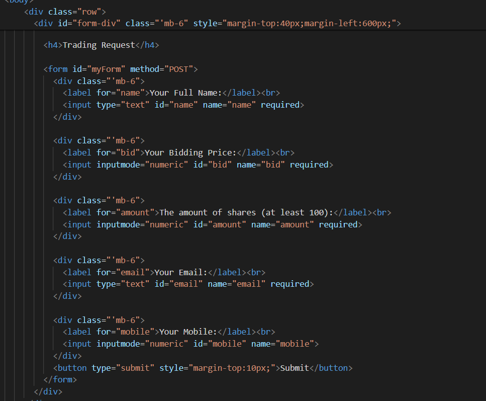

# Project-3---Group-2

Our proposal is written here:
https://docs.google.com/document/d/1966Fck0Z57jaAnJw_osNfomzqi6nW-hzQI0lGnqi5c8/edit?usp=sharing

# Xiang's Part

# 1.The blueprint of the whole project

* The idea of the project is to build a website thats similar to Yahoo Finance.
* yfinance is a python library that fuctions as an API to request data from Yahoo Finance.
* Python flask is the power engine thats used to build the website, 
  so that we can process data in the backend using python, and plotting graphs using pandas or matplotlib
* The data returned from yfinance can be passed to html paage and calling javascript function to further plotting those data.
* MongoDB is used to store data from user input on the website, and it also stores data from a csv file that has all the basic information from companies in Nasdaq.
* In summary, python flask is the backend to process the data, javascript is used to make the website interactive, and mongo DB is the database for this website.

# 2. The Earnings vs Revenues graph and Company details

* The start of the project is make a simple route ("/") in app.py, and run it on my local host.
* In my scrath jupyter notebook, I have tested different commands that do API requests.

* I have found the income statement to be particularly useful

* I use the earnings(income) and total revenues to plot a matplotlib 
* The above codes are collected and put into a python function in xiang.py as one of my methods
* The image data is transferred from python to javascript by using base64 class

* The image is dynamically generated and correctly displayed on the webpage

* Since the image is displayed correctly, the next step is passing a json file that contains all the company details

* The function is called in app.py and passed down to html page to be handled by javascript
* The idea to handle this data is to dynamically generate a table in javascript that holds all of this data

* And the final table looks like this:

* The problem with this table is that not all stocks have the some data fields, for example some stocks dont have bid price, and some dont have revenues, etc.
* Data validation needs to be implemented for future improvements
* Since the table and the plt graph is processed successfully, it is time to apply some css to the page.

* On the webpage is diaplayed like below (at the time, the news section wasnt added):

# 3. The news section

* Since the company details and the earnings graph only occupy 2/3 of the width of the page
* Another section I chose is the news, because when people check the stock, they would like to know some news about that company.
* The stock news is retrieved from yfinace as well, since it has a particular command for news.

* The difficulties here are to understand the data structure of the returned news.

* And how to handle the url when there is no image available for the particular stock.
* This final function is showing as down below:

* This function will be called in the app.py under the main route:

* How to handle the news data was quite a challenge in Javascript, because I want to make a dropdown menu to display the page number
* The page number will be furtherly used to slice the original news data to properly choose the range of the list

* I want the dropdown menu to be dynamically created, because the each stock has different number of news
* After the dropdown menu is created, it will do an initial call of the createNews function, so the news section shows first 3 news by default.
* And the createNews function takes in two arguments, page number and news data, because I need the page number to slice the news data

* The only problem here is when user select another page, how do we parse the selected value to re-call the function?
* The function is handled in Javascript

* But how to call the function is the thing I need to consider, and it is handled this way in the html:

* Eventually, the news section is displayed like this:

# 4. The index page and navigation bar

* The index page is designed to be like Google. The user will input the ticker of the stock he wants to search, and the the page will be directed to main page.
* And the there will be some quick access buttons under the search bar that can quickly direct to each group member's work.

* The input bar is designed to be like google, so when user press 'enter' key, the page should redirect.
* To do that, I add a key listener to this input box. And a safety check is also added to prevent the user doing an empty search.

* And finally, I add some styles to the index page:

* After the index page, I designed a navigation bar and the same search bar in embeded in the navigation bar
* The navigation bar is saved in its own nav.html page, so we do need to copy paste the codes around.

* The final navigation bar is like (the long term seach bar is added by another member):

# 5. The trading simulator

* The trading simulator is designed to fuction as a broker application
* In this page, we would have a random company chosen from Nasdaq market, and its historic price (both high and low are displayed).

* And there is a form to record the user's input, and the data would be stored in Mongo DB.

* To discuss the technical details behind the page, the first thing I did was to seach for a dataset that has all of basic info of Nasdaq companies
* It is a csv file thats downloaded from Nasdaq official site, and inserted into the database by a one line code
* I use pymongo to extract the company data from the database

* The function is called in the app.py and data is passed to the javascript to plot the graph

* A form is created to collect user's trading request

* The user input data will be stored into Mongo DB after submission

* And a thank you page with a go back will take the user back to the main page

# The end

* The project is designed to simulate Yahoo Finance, and the final website is fully functional and provide the same function as Yahoo Finance
* However, there are some places need to be improved, especially the data validation part.